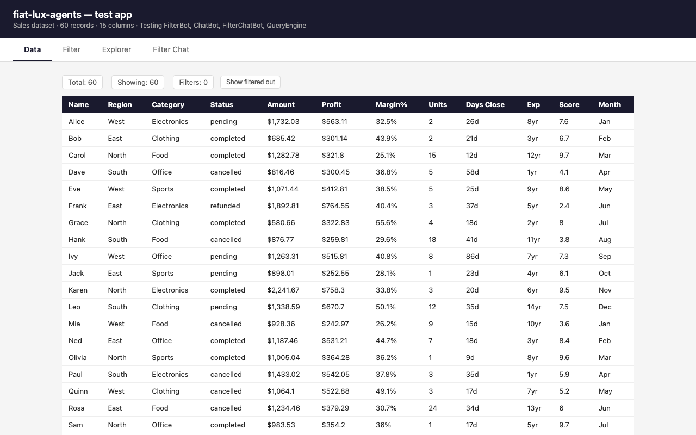
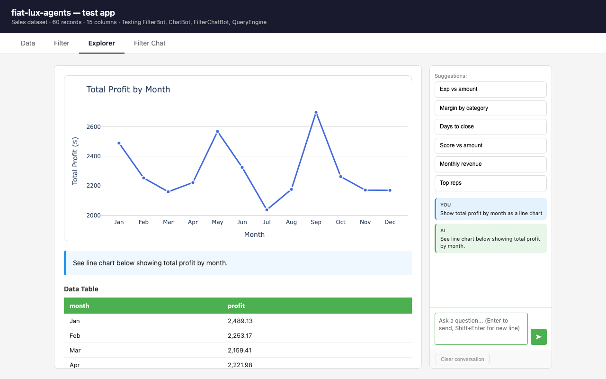
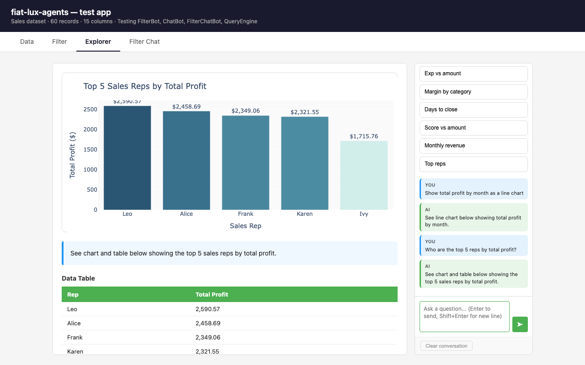

# fiat-lux-agents

> *Fiat lux* — let there be light. A collection of AI bots that help you see what's in your data.

Reusable Python bots for natural language data exploration. Drop them into any Flask app and get filtering, querying, and conversational analysis without reinventing the wheel each time.

---

## What it looks like

Your users talk to their data. The bots handle the rest.

The `make_explorer_blueprint` function gives you a complete chat-driven data explorer as a drop-in Flask blueprint. Wire it to your data and you get this:

**Your data, as a table** — the Data tab shows all rows and live filter state:



**Ask a question** — type freely or click a suggestion:



**Conversation** — follow-up questions build on the history; the sidebar shows the full exchange:



All of that — chart generation, pandas code execution, conversation history, suggestion buttons — comes from `make_explorer_blueprint`. You supply a function that returns a DataFrame; it handles the rest.

---

## Bots

| Bot | Description |
|---|---|
| [FilterBot](#filterbot) | Translates natural language into a structured filter spec for flat list-of-dicts data |
| [FilterEngine](#filterengine) | Executes filter specs against any list of dicts; maintains a toggleable filter stack |
| [FilterChatBot](#filterchatbot) | Conversation thread that routes messages to filter, question, or clear handlers |
| [HierarchicalFilterBot](#hierarchicalfilterbot) | Like FilterBot but for entities with nested child arrays |
| [HierarchicalFilterEngine](#hierarchicalfilterengine) | Like FilterEngine for hierarchical data; adds `enrich()` to precompute aggregates |
| [HierarchicalFilterChatBot](#hierarchicalfilterchatbot) | Like FilterChatBot but for hierarchical entity data |
| [ChatBot](#chatbot) | Generates pandas query code and a chart config from a natural language question |
| [SummaryBot](#summarybot) | Answers plain-text questions about a dataset — no code, no charts |
| [QueryEngine](#queryengine) | Safely validates and executes LLM-generated pandas code using AST parsing |
| [DocumentBot](#documentbot) | Generates HTML visualizations or answers questions from raw unstructured document text |
| [KnowledgeBot](#knowledgebot) | Answers questions from a curated domain knowledge base; returns markdown |
| [WebSearchBot](#websearchbot) | Searches the web or fetches a URL using Anthropic's built-in tools |
| [ChartDigitizerBot](#chartdigitizerbot) | Extracts data series from chart images with iterative self-correction |

---

### FilterBot
Translates natural language into structured filter specs for flat list-of-dicts data.

```python
from fiat_lux_agents import FilterBot

bot = FilterBot()
spec = bot.interpret_filter("only completed sales", sample_data=data[:5])
# {"filter_type": "include", "field": "status", "condition": "completed", ...}
```

Pass `sample_data` and the bot infers field formats itself — month abbreviations, date strings, mixed types — no special-casing needed.

---

### FilterEngine
Executes filter specs against any list of dicts. Maintains a stack of filters that can be toggled, removed, or cleared independently.

```python
from fiat_lux_agents import FilterEngine

engine = FilterEngine()
engine.add_filter(spec)
engine.toggle_filter(filter_id)   # disable without removing
engine.remove_filter(filter_id)
filtered = engine.apply(data)
```

The engine is stateless about data — pass data at apply time. The app owns the data.

---

### FilterChatBot
A single conversation thread that handles data questions, filter creation, and filter clearing — routing each message to the right handler automatically.

```python
from fiat_lux_agents import FilterChatBot

bot = FilterChatBot(dataset_description="15 sales records: name, region, category, status, amount, month")
intent, response, filter_spec = bot.process_message(
    "only show sales after March",
    conversation_history,
    data_context,
    sample_data=data[:5]
)
# intent → "question" | "filter" | "clear"
```

- `"question"` — answers with text ("show sales by month", "how many completed?")
- `"filter"` — returns a filter spec to apply ("only Electronics", "exclude West")
- `"clear"` — signals to remove all active filters ("clear filters", "show all data")

---

### HierarchicalFilterBot
Like `FilterBot` but for **hierarchical data** — entities (top-level dicts) that contain a nested child array of measurements or events. Knows three lambda strategies: field match, precomputed aggregate, and child-array drill-down.

```python
from fiat_lux_agents import HierarchicalFilterBot

bot = HierarchicalFilterBot(
    entity_schema="""
    - name (str): entity identifier
    - status (str): 'active' | 'inactive'
    - max_value (float): precomputed from data array
    - data (array): [{timestamp, value, ...}] — raw measurements
    """,
    entity_name="device",
    child_field="data"
)
spec = bot.interpret_filter("only devices where value ever exceeded 500")
# lambda that drills into the child array
```

Pass `sample_data` so the bot can see actual field names and formats.

---

### HierarchicalFilterEngine
Like `FilterEngine` but for hierarchical entities. Adds `enrich()` to precompute aggregates from child arrays — avoids writing lambdas for common stats.

```python
from fiat_lux_agents import HierarchicalFilterEngine

engine = HierarchicalFilterEngine()

# Precompute aggregates from child arrays (mutates in-place)
HierarchicalFilterEngine.enrich(entities, child_field="data", agg_specs=[
    {"name": "max_value", "source_field": "value", "fn": "max"},
    {"name": "value_count", "source_field": "value", "fn": "count"},
])
# Entities now have max_value and value_count as top-level fields

engine.add_filter(spec)
filtered = engine.apply(entities)
```

Supported aggregation functions: `max`, `min`, `sum`, `count`, `mean`, `first`, `last`.

---

### HierarchicalFilterChatBot
Like `FilterChatBot` but for hierarchical entity data. Combines `HierarchicalFilterBot` with direct Q&A — the same 3-intent model (`question` / `filter` / `clear`) wired for nested data.

```python
from fiat_lux_agents import HierarchicalFilterChatBot

bot = HierarchicalFilterChatBot(
    entity_schema=MY_SCHEMA,
    entity_name="device",
    child_field="data",
    dataset_description="200 IoT devices with hourly sensor readings."
)
intent, response, filter_spec = bot.process_message(msg, history, entities)
```

---

### ChatBot
Answers natural language questions by generating pandas query code and a visualization config. The calling app executes the query and renders the chart.

```python
from fiat_lux_agents import ChatBot

bot = ChatBot(schema="Columns: name (str), amount (float), category (str), month (str)")
result = bot.process_query("total amount by category", history, summary)
# result["response"]["query"]         → pandas code to execute
# result["response"]["visualization"] → {"type": "bar"} or {"type": "line"}, etc.
# result["response"]["answer"]        → brief text response
```

---

### SummaryBot
Answers natural language questions about a dataset in **plain text** — no pandas code, no chart. Good for conceptual questions, dataset descriptions, and quick factual lookups.

```python
from fiat_lux_agents import SummaryBot

bot = SummaryBot(dataset_description="56 horses with EIAV infection measurements.")
answer = bot.answer("what does VL stand for?")
answer = bot.answer("how many SCID horses are there?", context=stats_dict)
answer = bot.answer("same question but for Non-SCID", conversation_history=history)
```

Contrast with `ChatBot`, which always generates pandas code and a chart.

---

### QueryEngine
Safe execution of Claude-generated pandas code. Validates against a blocklist using AST parsing before running anything.

```python
from fiat_lux_agents import execute_query
import pandas as pd

df = pd.DataFrame(data)
result = execute_query('result = df.groupby("category")["amount"].sum().reset_index()', df)
# {"success": True, "data": [...], "columns": [...]}
```

Blocks: imports, exec, eval, file I/O, os/sys access, function/class definitions.

---

### DocumentBot
Generates self-contained HTML visualizations and answers questions from unstructured document text. Unlike `ChatBot` (which requires a DataFrame), `DocumentBot` reads raw text and outputs HTML — no parsing step or schema required. Designed for invoices, schedules, healthcare bills, contracts, and any document without a fixed schema.

```python
from fiat_lux_agents import DocumentBot

bot = DocumentBot()

# Initial visualization
result = bot.process(document_text, request="Show as a weekly calendar")
if result["html"]:
    # insert result["html"] into a div
else:
    print(result["message"])  # text answer, no viz change

# Follow-up styling (cheaper — no document resent)
result = bot.refine(result["html"], request="Make the header blue")

# Multi-document
result = bot.process(["January...", "February..."], request="Combine into one view")
```

Two methods:
- `process()` — sends full document context; use for initial visualization or questions that need the original document
- `refine()` — sends only the current HTML; faster and cheaper for layout/styling follow-ups

---

### KnowledgeBot
Answers research questions from a curated domain knowledge base. Inject papers, manuals, or domain notes as a text string, and the bot answers from that content rather than from general training knowledge. Returns markdown-formatted responses.

```python
from fiat_lux_agents import KnowledgeBot

bot = KnowledgeBot(knowledge=MY_KNOWLEDGE_TEXT)
answer = bot.answer("What are the candidate ODE models?")

# Narrow focus per page in multi-page apps
interp_bot = bot.with_page_context("Focus on platelet interpolation methods.")
answer = interp_bot.answer("Why is linear interpolation used?", history=prior_turns)
```

- Never invents information not present in the knowledge base
- Supports multi-turn conversation history (last 6 turns)
- `with_page_context()` returns a new bot sharing the same knowledge base — useful for per-page specialization without duplicating text

---

### WebSearchBot
Answers questions that require live internet access. Uses Anthropic's built-in server-side web search and fetch tools — no external API keys required.

```python
from fiat_lux_agents import WebSearchBot

bot = WebSearchBot()

# Search the web
answer = bot.search("current price of AAPL stock")

# Fetch and summarize a specific URL
answer = bot.fetch("https://example.com/product", question="What is the price?")
```

- `search()` — takes a query, searches, and returns a plain-text answer with URLs
- `fetch()` — fetches a specific URL and answers a question about it

---

### ChartDigitizerBot
Self-correcting scientific chart digitizer. Extracts numerical data series from chart images using a multi-pass feedback loop: extracts data, renders a comparison overlay, then asks Claude to fix gaps and missed peaks — repeating until the result stabilizes.

```python
from fiat_lux_agents import ChartDigitizerBot

bot = ChartDigitizerBot()
result = bot.digitize(
    image_bytes=png_bytes,
    chart_description="""
        X-axis: Days post-infection (0–600)
        Left Y-axis: Platelet count x1000/uL (linear, 0–350)
        Platelet: continuous solid black line
    """,
    data_keys=["platelets", "vl"],
    x_field="dpi",
    max_passes=4,
)
# result["platelets"] = [{"dpi": 0, "value": 197, "confidence": 0.9}, ...]
# result["_passes"]   = 3
# result["_stop_reason"] = "stabilized"
```

Completely generic — no assumptions about chart type. The caller describes the axes, scales, and marker types in plain text. Requires `matplotlib` for comparison chart rendering.

---

## Installation

```bash
pip install git+https://github.com/aabtzu/fiat-lux-agents
```

During development, install editable from a local clone:

```bash
git clone https://github.com/aabtzu/fiat-lux-agents
pip install -e ./fiat-lux-agents
```

Requires `ANTHROPIC_API_KEY` in your environment.

---

## Starting a New App

The fastest way to start a new app on top of fiat-lux-agents is the scaffold script. It creates the standard project structure, copies the `CLAUDE.md` template (so Claude Code has the right rules from message one), and wires up Flask, gunicorn, CI, and Render config:

```bash
git clone https://github.com/aabtzu/fiat-lux-agents
cd fiat-lux-agents
./scripts/new-app.sh my-app ~/repos/my-app
```

This gives you:

```
my-app/
├── CLAUDE.md                  ← rules for Claude Code (customise for your app)
├── app.py                     ← Flask factory
├── agents/
│   └── common/flask_utils.py  ← require_auth, json_ok, json_err
├── database/
│   ├── __init__.py
│   └── connection.py          ← get_db, init_db, PG + SQLite
├── static/{js,css}/
├── templates/
├── tests/conftest.py
├── dev.sh                     ← start / test / lint
├── render.yaml                ← Render deployment config
├── .github/workflows/ci.yml   ← ruff + pytest CI
├── requirements.txt
└── pyproject.toml             ← ruff config
```

Then:
```bash
cd ~/repos/my-app
python3 -m venv .venv && .venv/bin/pip install -r requirements.txt
# add ANTHROPIC_API_KEY to .env
./dev.sh start
```

Before deploying to Render, set `SECRET_KEY` and `ANTHROPIC_API_KEY` in the Render dashboard (never commit these). See `docs/app-claude-template.md` for the full conventions reference.

---

## Test App

A working Flask app with sample sales data demonstrating all bots:

```bash
git clone https://github.com/aabtzu/fiat-lux-agents
cd fiat-lux-agents
python -m venv .venv && .venv/bin/pip install -e ".[dev]"
.venv/bin/pip install flask python-dotenv
echo "ANTHROPIC_API_KEY=your_key" > testapp/.env
.venv/bin/python testapp/app.py
# → http://localhost:5003
```

Tabs: **Data** · **Filter** · **Query** · **Filter Chat**

---

## Architecture

Each bot has one job. The app wires them together.

```
User input
    │
    ▼
FilterChatBot              → determines intent (flat data)
    ├── question           → _answer_question() via Claude
    ├── filter             → FilterBot → FilterEngine.apply(data)
    └── clear              → FilterEngine.clear_filters()

HierarchicalFilterChatBot  → same model, hierarchical data
    ├── question           → _answer_question() with enriched entities
    ├── filter             → HierarchicalFilterBot → HierarchicalFilterEngine.apply(entities)
    └── clear              → HierarchicalFilterEngine.clear_filters()

ChatBot                    → generates pandas query + viz config
    └── QueryEngine        → validates + executes query on DataFrame

SummaryBot                 → plain text answers about a dataset, no code generation

DocumentBot                → unstructured document text → HTML visualization or text answer
    ├── process()          → full document context (initial viz, re-reads)
    └── refine()           → HTML-only context (faster for styling changes)

KnowledgeBot               → curated knowledge base → markdown Q&A answers
    └── with_page_context() → narrowed focus per page, shared knowledge base

WebSearchBot               → live internet queries → plain text answers
    ├── search()           → web search via Anthropic's built-in tools
    └── fetch()            → fetch + summarize a specific URL

ChartDigitizerBot          → chart image → extracted data series (JSON)
    ├── pass 1             → initial extraction from image
    ├── pass 2..N          → comparison overlay → Claude fixes gaps and missed peaks
    └── stop when          → point count stabilizes or max_passes reached
```

Data stays in the app. Bots borrow it, process it, return results.

---

## Base Class

All bots inherit from `LLMBase`, which wraps the Anthropic API:

```python
from fiat_lux_agents import LLMBase

class MyBot(LLMBase):
    def __init__(self):
        super().__init__(model="claude-sonnet-4-6", max_tokens=1000)

    def do_thing(self, input):
        return self.call_api(system_prompt, [{"role": "user", "content": input}])
```
